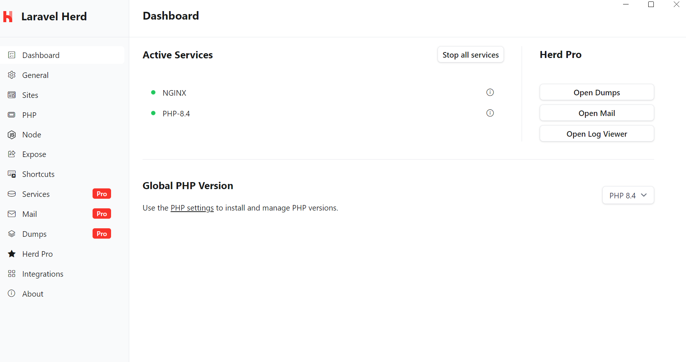
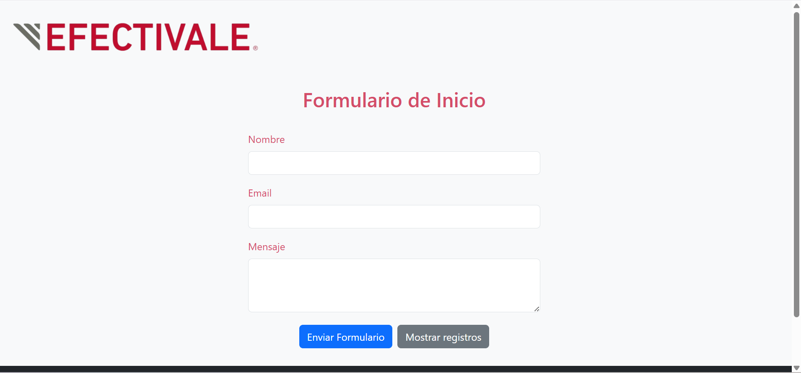
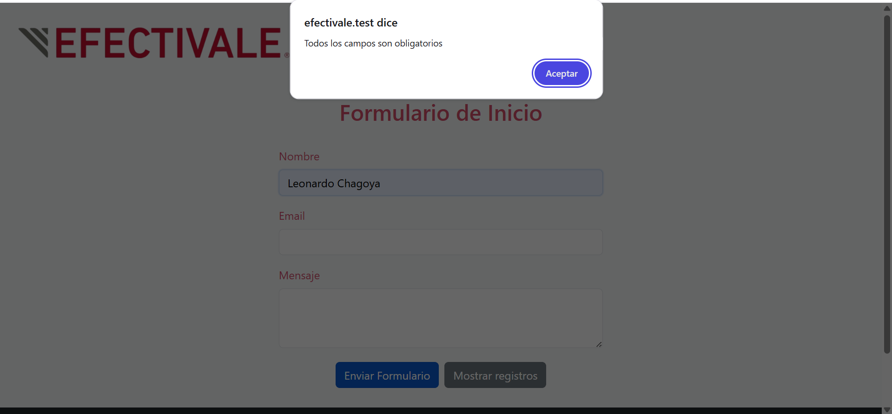
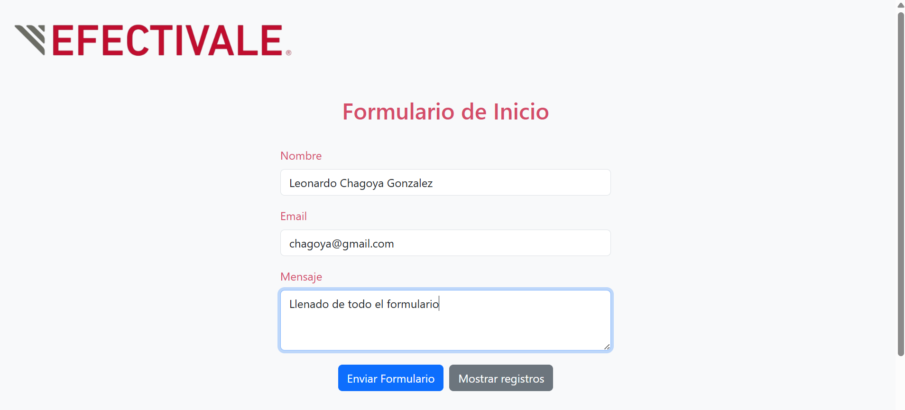
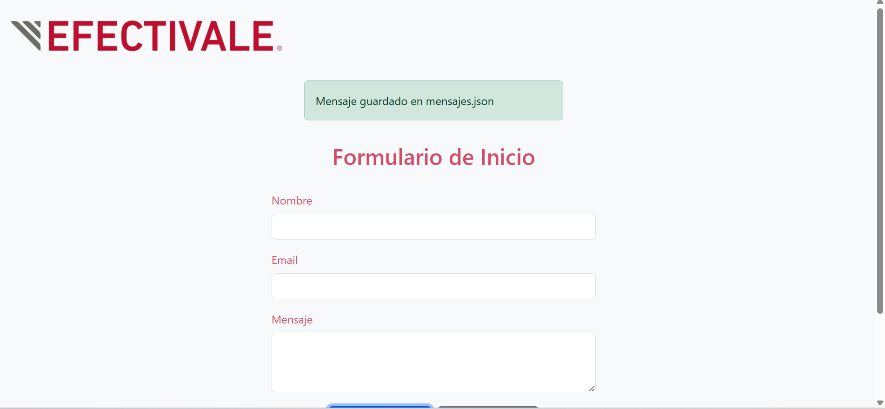
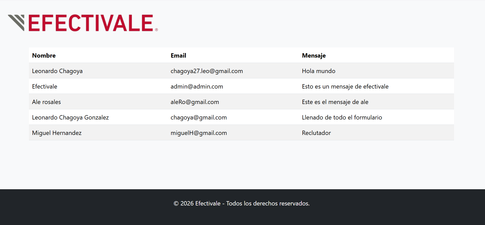

# Ejercicio EFECTIVALE

## Requerimientos

**Objetivo**: Crea una mini aplicación de formulario de contacto que guarda los mensajes en el
servidor y los muestra en otra página.

1. Formulario (index.html): Debe contener campos para Nombre, Email y
Mensaje. Utiliza Bootstrap para el estilo.
2. Validación: Usa JavaScript o jQuery para validar que los campos no estén vacíos.
3. Envío Asíncrono (AJAX): Los datos del formulario deben enviarse a
guardar_mensaje.php sin recargar la página.
4. Backend (guardar_mensaje.php): Este script debe recibir y almacenar los datos
en un archivo llamado mensajes.json.
5. Visualización (registros.html): Esta página debe leer el archivo mensajes.json
y mostrar todos los registros en una tabla HTML.

## Herramientas

- Laravel 11: Framework de PHP utilizado para la lógica del servidor (generación del archivo mensaje.json y redireccionamiento)
- Bootstrap 5: Para incorporar estilos.
- JavaScript con Fetch API: Para la implementación asincrona de mensajes.
- Blade Templates: Motor de plantillas de Laravel que permiten la integración de código HTML junto con PHP.

## Instalación 

Para poder levantar el proyecto se requieren de las siguientes herramientas

* PHP 8.3+
* Composer
* Node .js
* Npm

1. Como primer paso clonamos el repositorio mediante el comando

        git clone https://github.com/chagoya27/sistemaVotaciones.git

Dentro de la raiz de nuestro proyecto abrimos una terminal en donde ejecutamos los siguientes pasos

2. Instalamos las dependencias de PHP mediante el siguiente comando en terminal

        composer install

3. Instalamos las dependencias de JS mediante el siguiente comando en terminal

        npm install

4. Configuramos el archivo .env, para ello el repositorio tiene un .env.example por lo que solo hay que copiar su contenido mediante el comando

        cp .env.example .env

5. Generamos una llave unica para nuestra aplicación

        php artisan key:generate

6. Levantamos el proyecto mediante los comandos

        php artisan serve -> En terminal 1
        npm run dev -> En terminal 2

Una vez realizados estos pasos tendremos nuestra aplicación corriendo en local

    http://localhost:8000

**Alternativa**

Existe una forma aún más sencilla para poder correr un proyecto de Laravel (tanto en MacOs como en Windows), esto es mediante Laravel Herd. Podemos descargar dicha aplicación desde su [sitio oficial](https://herd.laravel.com/docs/macos/getting-started/installation). 

Esta aplicación descarga node, npm, php, realiza la ejecución de la llave, nos da una url para nuestro local.

La descarga es muy sencilla solo tendremos que tener cuidado en donde queremos que se coloque la carpeta de Herd ya que todos nuestros proyectos deben de ir dentro de dicha carpeta. Dentro de dicha carpeta clonamos el repositorio

    git clone https://githcom/chagoyasistemaVotaciones.git

Y en el apartado de **sites** damos click en el boton ***add*** seleccionando la carpeta de nuestro proyecto

## USO

Al levantar el proyecto, la primer vista que tenemos es un Header con el logro de la empresa **Efectivale**, un formulario con los campos Nombre, Email y Mensaje asi como un footer.

El formulario requiere del llenado de todos los campos, en caso de que esto no ocurra,lanzará un mensaje de alerta.

Una vez llenado todo el formulario, si damos click en el botón de ***enviar*** . Se ejecutará un envío asíncrono del formulario a una ruta llamada ***guardar-mensaje*** allí, verifica la existencia del archivo ***mensajes.json***, en caso de necesitarlo lo crea y agrega los datos del formulario. Por último, muestra un mensaje indicando que la información fue guardada con éxito.

El mensaje será removido en 3 segundos para que no exista confunsiones al enviar de nuevo el formulario.

Si damos click en el botón ***Mostrar registros*** podemos observar todas las peticiones realizadas con éxito. **POR DEFECTO EL ARCHIVO mensaje.json no existe esto por que se encuentra en una carpeta privada que no se sube a git** si damos click en **Mostrar registros*** no sucedera nada, sino hasta que se envie un formulario válido.

El archivo **mensaje.json** se encuentra dentro de storage/app/private. Esto por como se configura el disco local. 

    [
        {
            "name": "Leonardo Chagoya",
            "email": "chagoya27.leo@gmail.com",
            "message": "Hola mundo"
        },
        {
            "name": "Efectivale",
            "email": "admin@admin.com",
            "message": "Esto es un mensaje de efectivale"
        },
        {
            "name": "Ale rosales",
            "email": "aleRo@gmail.com",
            "message": "Este es el mensaje de ale"
        },
        {
            "name": "Leonardo Chagoya Gonzalez",
            "email": "chagoya@gmail.com",
            "message": "Llenado de todo el formulario"
        },
        {
            "name": "Miguel Hernandez",
            "email": "miguelH@gmail.com",
            "message": "Reclutador"
        }
    ]

## About Laravel

Laravel is a web application framework with expressive, elegant syntax. We believe development must be an enjoyable and creative experience to be truly fulfilling. Laravel takes the pain out of development by easing common tasks used in many web projects, such as:

- [Simple, fast routing engine](https://laravel.com/docs/routing).
- [Powerful dependency injection container](https://laravel.com/docs/container).
- Multiple back-ends for [session](https://laravel.com/docs/session) and [cache](https://laravel.com/docs/cache) storage.
- Expressive, intuitive [database ORM](https://laravel.com/docs/eloquent).
- Database agnostic [schema migrations](https://laravel.com/docs/migrations).
- [Robust background job processing](https://laravel.com/docs/queues).
- [Real-time event broadcasting](https://laravel.com/docs/broadcasting).

Laravel is accessible, powerful, and provides tools required for large, robust applications.

## Learning Laravel

Laravel has the most extensive and thorough [documentation](https://laravel.com/docs) and video tutorial library of all modern web application frameworks, making it a breeze to get started with the framework. You can also check out [Laravel Learn](https://laravel.com/learn), where you will be guided through building a modern Laravel application.

If you don't feel like reading, [Laracasts](https://laracasts.com) can help. Laracasts contains thousands of video tutorials on a range of topics including Laravel, modern PHP, unit testing, and JavaScript. Boost your skills by digging into our comprehensive video library.

## Laravel Sponsors

We would like to extend our thanks to the following sponsors for funding Laravel development. If you are interested in becoming a sponsor, please visit the [Laravel Partners program](https://partners.laravel.com).

### Premium Partners

- **[Vehikl](https://vehikl.com)**
- **[Tighten Co.](https://tighten.co)**
- **[Kirschbaum Development Group](https://kirschbaumdevelopment.com)**
- **[64 Robots](https://64robots.com)**
- **[Curotec](https://www.curotec.com/services/technologies/laravel)**
- **[DevSquad](https://devsquad.com/hire-laravel-developers)**
- **[Redberry](https://redberry.international/laravel-development)**
- **[Active Logic](https://activelogic.com)**

## Contributing

Thank you for considering contributing to the Laravel framework! The contribution guide can be found in the [Laravel documentation](https://laravel.com/docs/contributions).

## Code of Conduct

In order to ensure that the Laravel community is welcoming to all, please review and abide by the [Code of Conduct](https://laravel.com/docs/contributions#code-of-conduct).

## Security Vulnerabilities

If you discover a security vulnerability within Laravel, please send an e-mail to Taylor Otwell via [taylor@laravel.com](mailto:taylor@laravel.com). All security vulnerabilities will be promptly addressed.

## License

The Laravel framework is open-sourced software licensed under the [MIT license](https://opensource.org/licenses/MIT).
